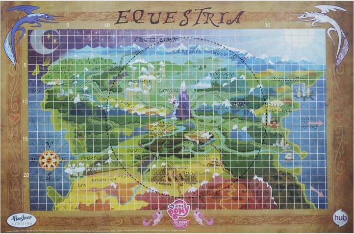

# Unit 3 Project

For this project we will be creating methods to help calculate travel routes around the fictional land of Equestria.



## Project 3.1: Circumfrence

Princess Luna and Celestia are going on a tour of the kingdom to greet the other citizens of Equestria.  Their tour takes them on a circular path around the kingdom.  Write a method called `roadTrip` that (1) accepts as a parameter the diameter of the circular path, and (2) returns the length of the trip. Add a call to this method in the `main` method of your program.

The equation for circumference is: 

***Hint*** Java has a math constant called `Math.PI`.

## Project 3.2: Distance

Write a method called `distance` that (1) accepts four integer coordinates: x1, y1, x2, y2 as parameters, (2) computes the distance between points (x1, y1) and (x2, y2) on the map, and (3) returns that distance.


Test out your program by adding calls to your  `main` method that calls the distance method for each of the following pairs of cities.  Your main method should output the value returned by the distance method. 

Example output

```
Distance from Baltimare (29, 16) to Manehattan (34, 8) = 9.4339811320566038113206603776226

Distance from Los Pegasus (6, 19) to Neighagra Falls (22, 7) = 20

Distance from the Badlands (25, 24) to Ponyville (16, 14) = 13.45362404707371031716308546217
```

## Project 3.3: Tour

Write a method called `tour` that helps Princess Luna plan a 3-stop tour of Equestria. Princess Luna has specifically requested that you choose three destinations in Equestria, as defined by their x and y coordinates on the map. You program should output the distance between the three.

You should use the distance method you wrote for Exercise 2.

## Project 3.4: Total Trip

Write a method called `totalTrip` that accepts parameters for 3 locations (each containing coordinates) and returns the total distance traveled by visiting all 3 locations and returning to the starting location (0,0). You should use the distance methods you wrote in Exercise 2 and you can choose the names of any 3 locations in Equestria - you can use the coordinates above or make up your own. Your program should output the distance between each stop and the total trip distance.

Example output

```
Distance from start (0,0) to Baltimare (29, 16) = 33.12099032335838837304308640515

Distance from Baltimare (29, 16) to Manehattan (34, 8) = 9.4339811320566038113206603776226

Distance from Manehattan (34, 8) to Neighagra Falls (22, 7) = 12.041594578792295480128241030379

Distance from the Neighagra Falls (22, 7) to Ponyville (16, 14) = 9.2195444572928873100022742817628

Distance from the Ponyville (16, 14) to start (0,0) = 21.260291625469298815998243829859

Total Trip Distance = 85.076402116969473790492505924773

```

Extra credit: make this program compute 4 locations instead!

